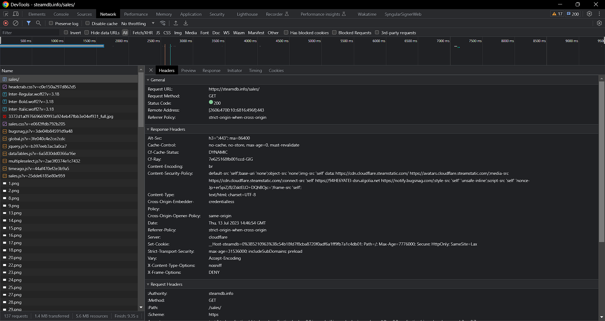
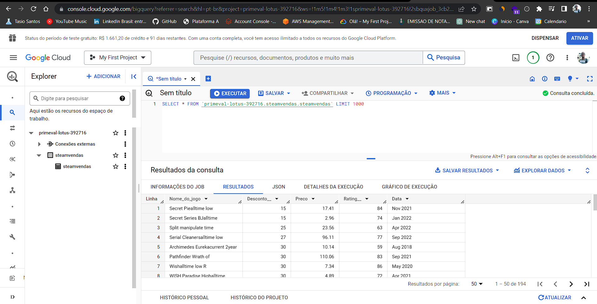
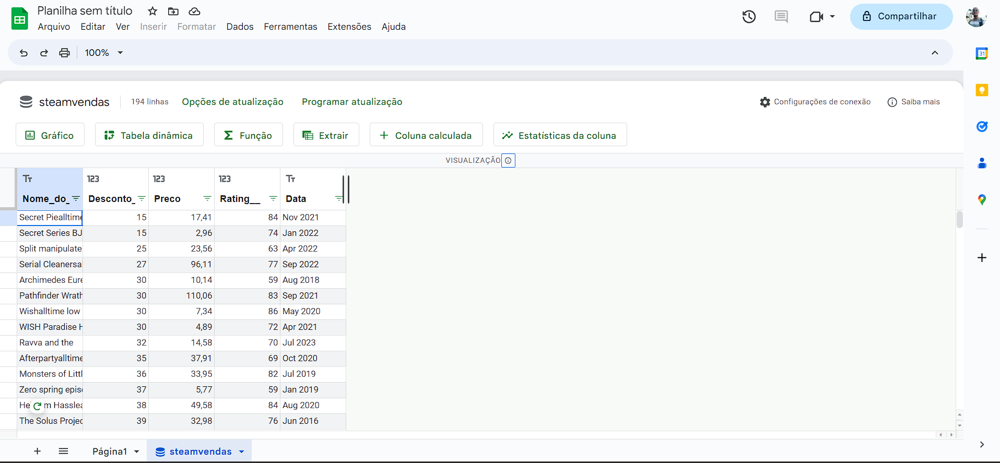
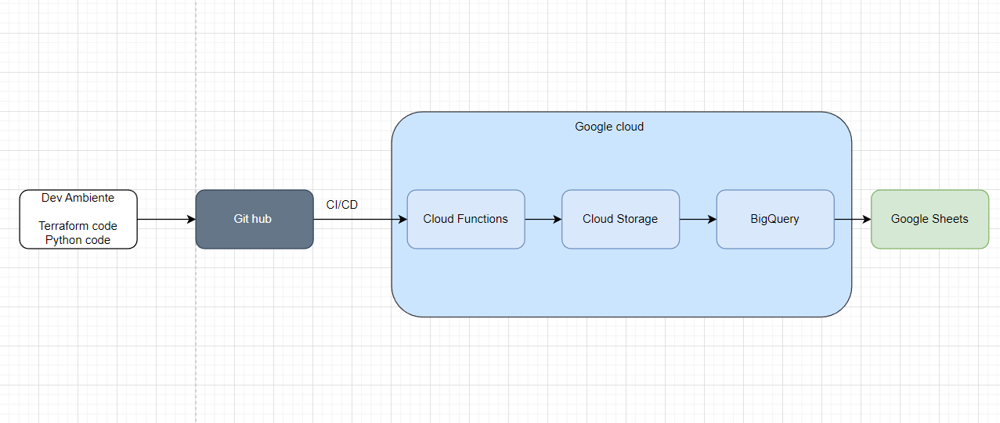

# Projeto: Análise de Dados da Steam

Este projeto consiste na extração, armazenamento e análise de dados relacionados às vendas do site SteamDB. A seguir, detalharemos as etapas envolvidas no processo.

## Como o projeto funciona

1. **Extração de dados da web**: Começamos com um script Python que realiza uma solicitação HTTP à página [SteamDB](https://steamdb.info/sales/). O script raspa os dados contidos na tabela de vendas e os salva em um arquivo no formato CSV.

2. **Armazenamento dos dados no Google BigQuery**: A próxima etapa consiste em armazenar os dados extraídos no Google BigQuery. Inicialmente, é necessário criar um projeto no Google Cloud. Em seguida, no BigQuery, é preciso criar um conjunto de dados e uma tabela para receber os dados. Com estas estruturas preparadas, é possível carregar os dados do arquivo CSV na tabela criada.

3. **Conexão dos dados com o Google Sheets**: O último passo envolve conectar os dados do BigQuery ao Google Sheets. Através da funcionalidade "Conectar-se ao BigQuery", disponível no Google Sheets, é possível realizar consultas SQL no BigQuery diretamente no Google Sheets e importar os resultados para a planilha desejada.

## Considerações Futuras

Embora o projeto esteja funcional, ele poderia ser aprimorado com mais tempo e recursos. Algumas possibilidades de aprimoramentos incluem:

1. Implementação de um processo de Integração Contínua/Entrega Contínua (CI/CD) utilizando GitHub Actions.
2. Aumento da segurança do projeto através da ocultação do arquivo `headers.py` com o uso dos segredos do GitHub.
3. Automatização do processo e implantação no Google Cloud Platform (GCP), utilizando serviços como o Cloud Functions e o Cloud Storage.
4. Utilização de Infraestrutura como Código (IaC) com o Terraform para gerenciar os custos da infraestrutura no GCP e ter maior controle sobre os recursos utilizados.

## Arquitetura do Pipeline

A seguinte imagem ilustra como seria a arquitetura do pipeline após a implementação das melhorias propostas:

Para ter uma estimativa dos custos associados a esta arquitetura, acesse o seguinte link: [Estimativa de Custo](https://cloud.google.com/products/calculator/#id=04c1dc80-d414-46be-b3d2-5fe167f7db59).
